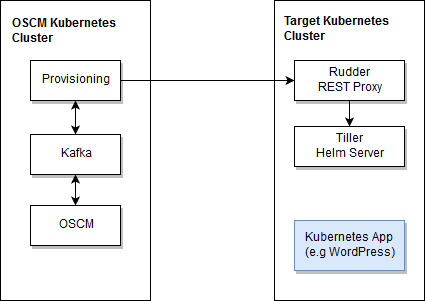

# oscm-helm
Helm charts for provisioning OSCM on Kubernetes.

## oscm-demo-helm
The repository contains also templates for deployment of OSCM as a platform for managing Kubernetes applications using Helm. 
The `oscm-demo-helm` directory contains:
- `kubernetes-templates` - Kubernetes templates for deployng OSCM applications, Kafka and Rudder REST Proxy for Helm.
- `oscm-service` - Sample OSCM service definition for installing WordPress on Kubernetes with OSCM.

The same cluster is used for deploying the OSCM with all necessary applications and as a target cluster for applications managed by OSCM. The deployment can be adapted as needed (different clusters for OSCM and for managed apps, or different namespaces).  
The image below shows deployment in different clusters.

**TODO**
- [ ] Simplify the installation using Helm charts.
- [ ] Solve [issue](https://github.com/servicecatalog/provisioning-service/issues/8)

## Deployment in GCP

Prerequisites:
- gcloud SDK with kubectl (alternatively you can use the Kubernetes Dashboard)
- Kubernetes cluster with 2 nodes type "n1-standard-2" (2CPU, 7.5GB)
- Gmail account for OSCM mail notification with less secure sign-in (or other mailserver solution)

Assuming that kube configuration has the target cluster in the current context, execute the following installation steps in the given order:

### Install Helm

Helm has two parts: a client (`helm`) and a server (`tiller`). Tiller runs inside of your Kubernetes cluster, and manages releases (installations) of your charts. Download the binaries for your system [here](https://github.com/kubernetes/helm/releases). 

The command `helm init` will install the `tiller` server in your cluster.

### Install Rudder

Rudder Proxy interfaces the Helm Chart repositories and the Helm Tiller servrer. The public  [kubernetes charts](https://github.com/kubernetes/charts) repository is configured in the `rudder-repositories.yaml` file. You can add your own Helm Chart repository to this file. The `rudder-repositories.yaml` is saved as a Kubernetes secret.

1. `kubectl create generic rudder-repositories --from-file rudder-repositories.yaml`
2. Extract the IP and Port of the `tiller` pod and adapt it in the `rudder.yaml` via`kubectl get pod --all-namespaces`
3. `kubectl create -f rudder.yaml`

### Install Kafka

1. `kubectl create -f zookeeper.yaml`
2. `kubectl create -f kafka.yaml`

### Install OSCM Applications

1. `kubectl create -f helm-provisioning.yaml`
2. `kubectl create -f oscm-db.yaml`
3. `kubectl create -f oscm-initdb-jms.yaml`
4. `kubectl create -f oscm-bes-svc.yaml`
5. Extract the port of the bes service and adapt it in the `oscm-initdb-bes.yaml` file via `kubectl get svc`
6. `kubectl create -f oscm-initdb-bes.yaml`
7. `kubectl create -f oscm-bes-pod.yaml`

### OSCM Service Definition for Helm Charts

In order to manage the Kubernetes applications with OSCM, they must be represented in OSCM with corresponding service definitions (OSCM technical service). The OSCM service definition describes:  
- The target Kubernetes cluster (URL of the Rudder proxy) where the application will be deployed (parameter `target`);
- The target Kubernetes namespace for deployment (parameter `namespace`)
- The provisioning template (parameters with prefix `template.` for chart repository, name and version);
- Kubernetes label as identifying attributes for the deployment (parameter `labels.release`)
- Application parameters (parameters with prefix `parameters.` which correspond to the values in `values.yaml` from the chart).

A sample service definition for the [`wordpress`](https://github.com/kubernetes/charts/tree/master/stable/wordpress) chart from [kubeapps repository](https://github.com/kubernetes/charts) can be found [here](https://github.com/servicecatalog/oscm-helm/blob/master/oscm-demo-helm/oscm-service/TechnicalServicesHelmWordPress.xml).

### Getting Started

To start working with OSCM, please see the [Getting Started](https://github.com/servicecatalog/development/wiki/Getting-Started) guide.

If you use the sample [wordpress service](https://github.com/servicecatalog/oscm-helm/blob/master/oscm-demo-helm/oscm-service/TechnicalServicesHelmWordPress.xml), you can define meaningful configuration for it:

- let the user configure wordpress version, admin credentials, blog name and cluster resources by subscribing
- define prices for cluster resources (cpu, memory, storage)

*Note: After the subscription is ready to use, it is planned to see the access information (URL or other) in OSCM ([issue](https://github.com/servicecatalog/provisioning-service/issues/8)). Till the issue is solved, the access information can be seen in `Kubernetes Dashboard` or extracted with `kubectl` command*.

The wordpress application can be managed with modifying the corresponding OSCM subscription:
- upgrade/downgrade using different wordpress version
- scale up/down with using differen cluster resources
- delete the application with teminating the OSCM subscription

Enjoy!

